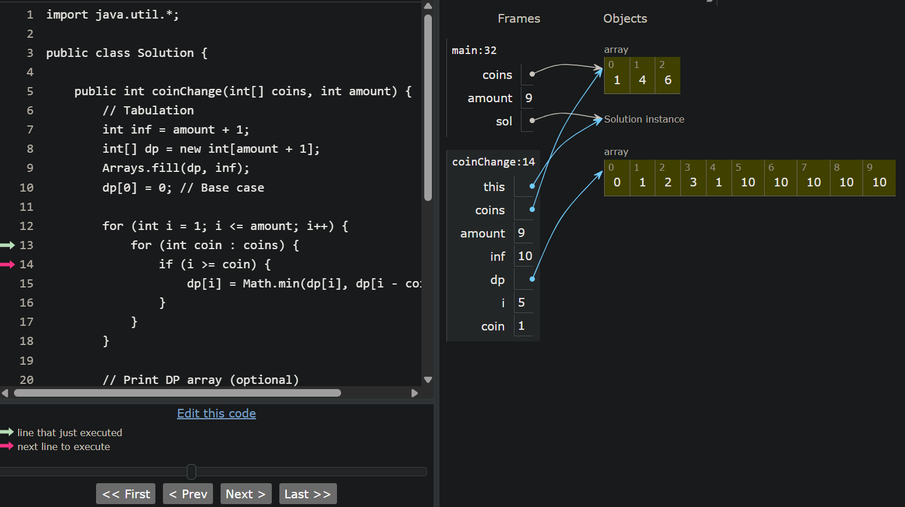

# 322. Coin Change


---

## 📖 Problem Statement

You are given an integer array `coins` representing coins of different denominations and an integer `amount` representing a total amount of money.

Return the **minimum number of coins** required to make up the given amount.

If it is impossible to form the amount using the given coins, return `-1`.

You may assume that you have an **infinite number** of each type of coin.

---

# 💡 Observation

For every amount, we can try using each available coin.

If a coin can contribute to the current amount, we check whether using that coin gives a better (smaller) answer than the one already found.

Since every amount depends on previously computed smaller amounts, this is a **1D Dynamic Programming** problem.

---

# 🧠 DP Thinking

## What does the question ask?

Find the **minimum number of coins** required to form the given amount.

---

## What is the subproblem?

Let

```
dp[i]
```

represent the **minimum number of coins required to make amount `i`**.

---

## Recurrence Relation

For every amount,

try every available coin.

If the coin can be used,

```
dp[i] = min(dp[i], dp[i-coin] + 1)
```

The `+1` represents the current coin being used.

---

## Base Case

```
dp[0] = 0
```

Zero coins are needed to make amount `0`.

---

## Initialization

Initially,

every amount is considered impossible to form.

```
dp[i] = amount + 1
```

This acts as **infinity (INF)**.

If a value remains `INF` after processing all coins,

the amount cannot be formed.

---

# ✅ Approach : Tabulation (Bottom-Up DP)

### Idea

Start from amount `0`.

For every amount from `1` to `amount`,

try every available coin and choose the minimum number of coins required.

Build the DP array from smaller amounts to larger amounts.

---

### Algorithm

- Create a DP array of size `amount + 1`.
- Initialize every value with `INF`.
- Set `dp[0] = 0`.
- For every amount:
  - Try every coin.
  - Update the minimum number of coins.
- If the final answer is still `INF`, return `-1`.
- Otherwise, return `dp[amount]`.

---

### Time Complexity

```
O(amount × number of coins)
```

---

### Space Complexity

```
O(amount)
```

---

### Code

```java
import java.util.*;

class Solution {

    public int coinChange(int[] coins, int amount) {
        // Tabulation
        int inf = amount + 1;
        int[] dp = new int[amount + 1];
        Arrays.fill(dp, inf);
        dp[0] = 0; // Base case

        for (int i = 1; i <= amount; i++) {
            for (int coin : coins) {
                if (i >= coin) {
                    dp[i] = Math.min(dp[i], dp[i - coin] + 1);
                }
            }
        }

        return dp[amount] == inf ? -1 : dp[amount];
    }
}
```

---

# 📊 Complexity

| Approach | Time Complexity | Space Complexity |
|-----------|-----------------|------------------|
| Tabulation | O(amount × number of coins) | O(amount) |

---

# 🔍 DP Visualization

Understanding how the DP array is built becomes much easier when you execute the algorithm step by step.

The following visualization was generated using **Python Tutor**, which allows you to inspect variables, the DP array, and execution flow interactively.

### Preview

> 📷 

---

### Try it Yourself

Visualize your own inputs and watch the DP array update step by step using **Python Tutor**.

🔗 https://pythontutor.com/visualize.html#mode=edit

Simply paste the code into the editor, click **Visualize Execution**, and step through each iteration to see how the DP array is built.

---

# 🎯 Key Takeaways

- Coin Change is a classic **1D Dynamic Programming** problem.
- Define the DP state as:

```
dp[i]
```

= Minimum number of coins required to make amount `i`.

- The recurrence relation is:

```
dp[i] = min(dp[i], dp[i-coin] + 1)
```

- Initialize every value with **INF (`amount + 1`)** to represent an impossible state.
- Set the base case:

```
dp[0] = 0
```

- If `dp[amount]` remains `INF`, the amount cannot be formed, so return `-1`.
- Since each amount is built using previously computed smaller amounts, tabulation efficiently avoids repeated computations.

---

## 🚀 Next Step

Try implementing the **Memoization (Top-Down DP)** solution using the same DP state and recurrence relation.

The only difference is that the states are computed **on demand** through recursion instead of iteratively.
